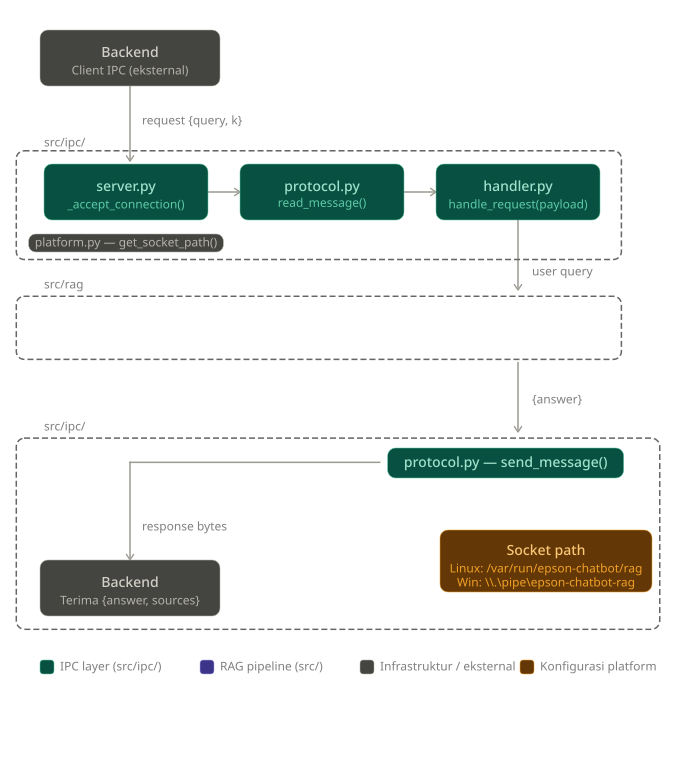

# Menyediakan IPC

[en](../../../en/features/01-chat-response/serving-ipc.md) · [id](#)

## Ringkasan Proyek

RAG chatbot enterprise menerima query dari backend via IPC, memproses dengan LLM + vector DB, dan mengembalikan jawaban via IPC juga.

---

## Tujuan Langkah Ini

Menyediakan IPC server sebagai pintu masuk komunikasi antara backend dan proses RAG.

---

## Tentang IPC

IPC (*Inter-Process Communication*) adalah cara dua program
berkomunikasi di komputer yang sama tanpa menggunakan jaringan (misalnya HTTP, internet).

---

## Peran

Backend bertindak sebagai IPC client. RAG bertindak sebagai IPC server.

---

## Lokasi Socket

RAG membuat socket di path yang telah ditentukan saat startup. Backend akan mengakses path tersebut untuk menghubungi RAG.

| Platform | Lokasi |
|---|---|
| Linux | `/var/run/epson-chatbot/rag` (Unix Domain Socket) |
| Windows | `\\.\pipe\epson-chatbot-rag` (Named Pipe) |

> **Catatan untuk Linux:** Direktori `/var/run/epson-chatbot/` harus dibuat manual dengan privilege root jika belum ada.

---

## Struktur Modul

```
src/
├── ipc/ (baru)
│   ├── __init__.py  (baru)
│   ├── server.py    (baru)     # Entry point server IPC
│   ├── handler.py   (baru)     # Proses request masuk
│   ├── protocol.py  (baru)     # Serialisasi/deserialisasi pesan
│   └── platform.py  (baru)     # Deteksi OS dan resolusi path socket
├── config.py
└── logger.py
```

---

## Struktur Modul

```
src/
├── ipc/ (baru)
│   ├── __init__.py  (baru)
│   ├── server.py    (baru)     # Entry point server IPC
│   ├── handler.py   (baru)     # Proses request masuk
│   ├── protocol.py  (baru)     # Serialisasi/deserialisasi pesan
│   └── platform.py  (baru)     # Deteksi OS dan resolusi path socket
├── config.py
└── logger.py
```

---

## Alur Sistem



---

## Rekomendasi Urutan Implementasi

---

### 1. `platform.py`

- [ ] `is_windows()` — return `true` jika platform adalah windows
- [ ] `get_socket_path()` — return konstanta sesuai platform
- [ ] `ensure_socket_dir()` — buat direktori parent dengan `Path.mkdir(parents=True, exist_ok=True)`; pastikan ada if untuk skip jika Windows
- [ ] `cleanup_stale_socket()` — hapus file socket jika ada dengan `Path.unlink(missing_ok=True)`; pastikan ada if untuk skip jika Windows

---

### 2. `protocol.py`

- [ ] `read_message()` — baca pesan `conn.recv`
- [ ] `send_message()` — `conn.sendall()`

---

### 3. `handler.py`

- [ ] `_validate_payload()` — cek `query` ada dan tidak kosong; cek `k` antara 1–20
- [ ] `_build_error_response()` — return `{"ok": False, "error": message}`
- [ ] `handle_request()` — panggil `_validate_payload()`, lalu panggil RAG pipeline (stub dulu), return response

> **Catatan:** Untuk tahap ini, RAG pipeline boleh di-stub dengan return dummy seperti:
> ```
> Berdasarkan informasi yang diberikan, kemungkinan masalah terjadi karena konfigurasi sistem atau proses yang belum berjalan dengan benar. Silakan periksa kembali apakah layanan yang diperlukan sudah aktif dan tidak ada kesalahan pada pengaturan koneksi atau path yang digunakan. Jika masalah masih terjadi, coba jalankan ulang aplikasi dan pastikan semua dependensi telah terinstal dengan benar.
> ```

---

### 4. `server.py`

- [v] `_setup_socket()` — panggil `cleanup_stale_socket()` dan `ensure_socket_dir()`, buat socket, bind ke path, `listen()`
- [v] `_accept_connection()` — `read_message()` → `handle_request()` → `send_message()` → tutup koneksi
- [ ] `start_server()` — panggil `_setup_socket()`, loop `accept()`, tiap koneksi masuk panggil `_accept_connection()`

---

### 5. Verifikasi manual

- [ ] Jalankan `start_server()` di satu terminal
- [ ] Kirim request dummy dari `Backend Emulator` atau script client sederhana buatan sendiri di terminal lain
- [ ] Pastikan response diterima dengan benar